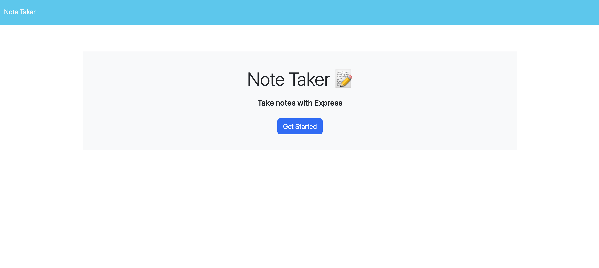
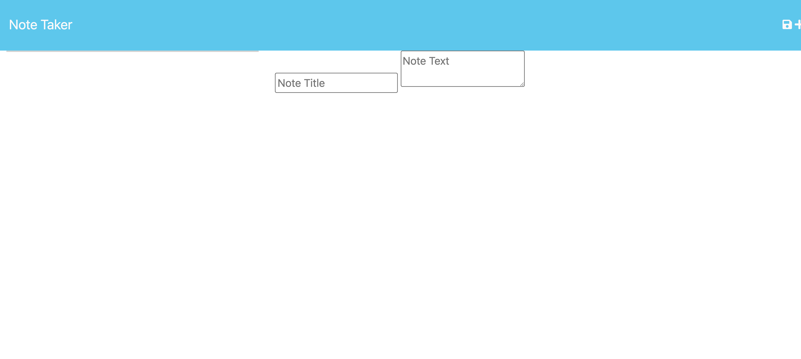

# Challenge 11: Note Taker 

## Description
The Note Taker is an application that allows users to write, edit, save, and delete notes for their convienance. 

This application uses an Express.js back end development to save and retrieve note data from a JSON file.

The University of Wisconsin provided this [Starter-code](https://github.com/coding-boot-camp/miniature-eureka) for the front end development.

The application can be deployed here: [Heroku](https://express-note-taker-challenge11-eb0f5d5a8458.herokuapp.com/)

## Questions
If you have any questions contact me here:

  [GitHub](https://github.com/lizf57)
  
  [Email: lizfriedman5@gmail.com](mailto:lizfriedman5@gmail.com)

